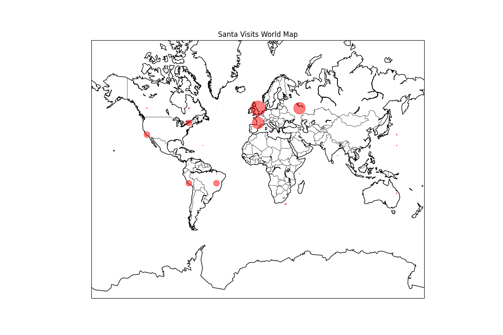

# Quantum Santa: Analyzing Santa's Visits as a Quantum Phenomenon

This project explores the concept of Santa Claus as a quantum phenomenon, analyzing his potential visits across the globe on Christmas Eve. The analysis involves generating data on estimated household visits, storing this data in a SQLite database, and visualizing it on a world map.

## Project Overview

The project consists of several scripts that work together to estimate and visualize Santa's visits:

- **methodology.sh**: Generates JSON files containing time zone and latitude data, which are used to estimate household visits.
- **make_sqlite_database.py**: Processes JSON files to populate a SQLite database (`santa_routes.db`) with estimated household visit data.
- **worldmap.py**: Visualizes the data from the database on a world map, highlighting the estimated number of households Santa visits in various regions.

## Visualization

The world map below illustrates the estimated number of households Santa visits across different time zones and latitudes. Each red dot represents a location, with the size of the dot proportional to the number of households.
## Automated Workflow

This project includes a GitHub Actions workflow that automates the execution of the scripts and verifies successful completion. The workflow is triggered on every push or pull request to the `main` branch. It performs the following steps:

- Checks out the repository.
- Sets up the Python environment.
- Installs necessary dependencies.
- Runs `methodology.sh` to generate JSON data files.
- Executes `make_sqlite_database.py` to populate the SQLite database.
- Verifies the existence of `santa_routes.db`.
- Ensures JSON files are generated in the `outputs` directory.

## Instructions

To manually run the scripts:

1. Run `methodology.sh` to generate the necessary JSON data files.
2. Execute `make_sqlite_database.py` to populate the SQLite database with the generated data.
3. Run `worldmap.py` to create and display the world map visualization. The map will be saved as `worldmap.png`.

Ensure all dependencies, such as Python libraries for database handling and plotting, are installed before executing the scripts.

The GitHub Actions workflow will automatically perform these steps and check for successful execution, providing a convenient way to ensure the project is functioning correctly.
